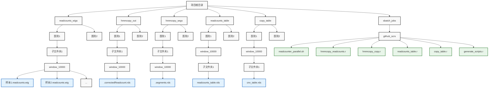

# CNV 矫正估计工作流程

本项目提供了一系列利用 **HMMcopy** 包对高通量测序数据进行拷贝数变异（CNV）矫正估计的脚本。这些脚本构成了一个完整的工作流，从 reads 计数、数据校正、拷贝数估计，到最终的矩阵生成，均以 R 脚本和 Shell 脚本的形式实现。项目的各个模块能够灵活配置参数，方便用户根据实际需求定制数据处理流程。


## 项目模块概览

- **readcounter_parallel.sh**
  利用 HMMcopy_utils 工具中的 `readCounter` 对 BAM 文件进行 reads 计数，生成无重叠窗口区间下的 `.wig` 文件。该脚本采用 GNU Parallel 以并行方式提交任务，并利用 SLURM 进行作业调度。
  **自定义设置部分：**
  - `your_conda_path`：Conda 环境路径。
  - `your_Read_Counter_path`：readCounter 可执行程序的完整路径。
  - `your_bam_dir`：存放 BAM 文件的根目录。
  - `your_output_dir`：输出 wig 文件的目录。
  - `your_window_size`：指定的窗口大小。

- **hmmcopy_readcounts.r**
  使用 **HMMcopy** 包读取已生成的 `.wig` 文件，对 readcounts 数据进行校正，输出 `.rds` 格式的校正结果。
  **自定义设置部分：**
  - `base_path`：原始数据文件的根目录。
  - `output_base_path`：校正后的数据保存目录。
  - `readcounts_path`：存放 `.wig` 文件的文件夹路径。
  - `window_sizes` 与 `window_folders`：窗口大小及其对应的文件夹名称。

- **hmmcopy_copy.r**
  基于校正后的 readcounts 数据，通过调用 **HMMsegment** 函数，进一步计算各区间的拷贝数（输出中 state 列数据，实际拷贝数为 state - 1），结果保存为 `.rds` 格式。
  **自定义设置部分：**
  - 设置输入和输出目录（对应校正数据与拷贝数结果）。
  - 修改样本文件名匹配规则和进程管理（并行处理和任务进度控制）。

- **readcounts_table.r**
  整合所有校正后的 readcounts 数据，生成包含各样本 readcounts 信息的矩阵。该矩阵以行保存窗口（包含染色体、起始和终止位置），每个样本的数据作为一列存入。
  **自定义设置部分：**
  - `base_input_dir` 与 `base_output_dir`：输入、输出基础目录。
  - `hospital_name`、`your_window_size`、`your_hmmcopy_number`：医院名称、窗口大小和对应的 hmmcopy 序号。
  - 代码内部使用 `file.path()` 构建了标准目录路径，便于跨平台使用。

- **copy_table.r**
  利用预处理得到的包含拷贝数信息的 `.segments.rds` 文件，生成最终的 CNV 矩阵（cnv_table.rds）。
  **自定义设置部分：**
  - 输入参数包括 `base_input_dir`、`hospital_name`、`window_size`、`segs_number` 等。
  - 构建输入输出路径时，根据参数生成对应的分段和窗口目录。
  - 支持断点续处理，通过记录已处理样本文件来实现任务进度维护。

- **generate_scripts.r**
  一个生成器脚本，用于自动生成多个任务脚本与相应的 sbatch 作业提交脚本。
  用户可通过设定医院名称、窗口大小和分段数等参数，快速生成分布在不同文件夹下的任务脚本，方便在集群上批量提交。
  **自定义设置部分：**
  - 修改 `hospital_names`、`window_sizes`、`segs_count` 参数。
  - 设置工作目录（`setwd("your_working_directory")`）以及生成脚本存放的目录。
  - 模板中的文件路径（如 `your_base_input_dir`、`your_output_base_dir`、`your_conda_path`、`your_working_directory` 等）需根据实际环境进行调整。


## 使用指南

### 1. 依赖环境

- **R 包要求：**
  - `data.table`
  - `dplyr`
  - `readr`
  - `parallel`
  - `GenomicRanges`
  - `gtools`
  - `HMMcopy`

- **系统工具：**
  - GNU Parallel（通过 conda 安装）
  - SLURM 作业调度系统

- **Conda 环境设置：**
  确保已安装 HMMcopy 相关依赖，并配置好 conda 环境（修改脚本中 `your_conda_path` 与 `source activate hmmcopy` 等部分）。

### 2. 配置自定义参数

所有脚本中均包含用户需要自行设定的变量，如：
- 基础输入/输出路径（如 `base_input_dir`、`base_output_dir`、`your_base_path` 等）；
- 医院名称（如 `hospital_name`）；
- 窗口大小（如 `window_size`、`your_window_size`）；
- 分段编号或 hmmcopy 序号（如 `segs_number`、`hmmcopy_number`）；
- 其他文件路径等。

请在执行前，根据实际环境修改对应脚本内的占位符文本，确保路径和参数配置正确。

### 3. 脚本执行流程

1. **生成 `.wig` 文件：**
   使用 `readcounter_parallel.sh` 脚本调用 readCounter 工具，对 BAM 文件批量计数。
   *提交方法：*
   ```bash
   sbatch readcounter_parallel.sh
   ```
   处理完成后，所有生成的 `.wig` 文件将存放在 `readcounts_wigs` 目录下的对应医院和窗口大小子目录中。

2. **校正 readcounts 数据：**
   运行 `hmmcopy_readcounts.r` 脚本，对 `.wig` 文件进行 HMMcopy 校正，生成 `.correctedReadcount.rds` 文件，存储在 `hmmcopy_out` 下。

3. **生成拷贝数数据：**
   运行 `hmmcopy_copy.r`，基于校正后的数据提取拷贝数信息（保存为 `.segments.rds` 文件），输出至 `hmmcopy_segs` 目录。

4. **生成 readcounts 矩阵：**
   执行 `readcounts_table.r` 脚本，将校正后的多个样本数据整合为一个 readcounts 矩阵，结果保存为 `readcounts_table.rds` 文件，存储在 `readcounts_table` 目录下。

5. **生成 CNV 矩阵：**
   运行 `copy_table.r` 脚本，根据各样本的拷贝数（`.segments.rds` 文件），生成最终的 CNV 矩阵（`cnv_table.rds`），存储在 `copy_table` 目录下。

6. **自动生成任务脚本：**
   若需批量生成不同参数的任务脚本，可运行 `generate_scripts.r`。此脚本将根据指定的医院、窗口大小与分段数，自动生成项目中各个任务的处理脚本和相应的 sbatch 提交脚本，文件存放在 `sbatch_jobs/scr/segs_table_new` 目录下。

   *执行方法：*
   ```bash
   Rscript generate_scripts.r
   ```


## 注意事项

- **路径及参数设置：**
  请务必根据实际数据存储位置修改各脚本中的路径参数。
- **断点续处理：**
  部分脚本（如 `copy_table.r` 和 `readcounts_table.r`）支持断点续处理，通过记录已处理的样本文件实现重新启动时跳过已完成任务。
- **并行处理：**
  `readcounter_parallel.sh` 和 `hmmcopy_copy.r` 中采用并行计算，请根据服务器配置合理设置核心数和批处理大小，避免资源竞争。
- **日志和错误处理：**
  每个脚本均自带日志记录和错误捕获机制，建议定期检查输出日志和错误文件以保证数据处理正常进行。


## 文件目录结构示例


